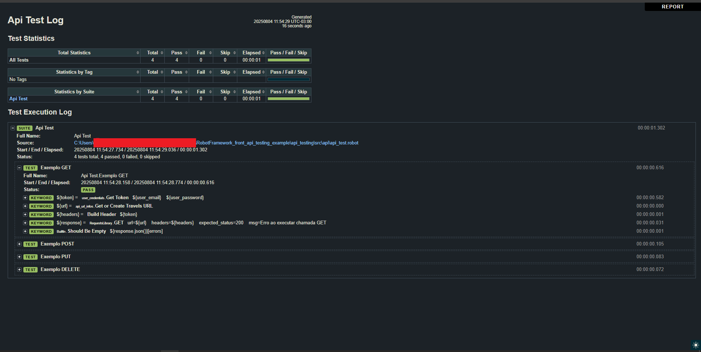
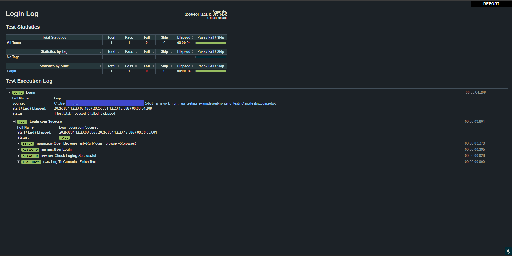

# Robot Framework - Exemplos básicos de uso (Testes de API Rest e Front-end E2E)

Robot Framework é um framework genérico focado em Testes automatizados e RPA. Ele é projetado utilizando Keyword-Driven como abordagem principal, onde temos palavras-chaves que executam funções para realizar processamentos. Com ajuda de bibliotecas, normalmente escritas em Python (inclusive a Built-in), criadas em cima de frameworks/bibliotecas famosos como Python Requests Library, Selenium e Appium, podemos utilizar o framework para realização de Testes de APIs Rest, UI e Mobile com uma única ferramenta, linguagem e sintaxe.

Esse projeto contém exemplos básicos de uso do framework para Testes de API Rest e Front-End (E2E) de aplicações.

## 🌟 Características Principais do Framework

- **Escrita de alto nível**: Linguagem simples e legível. Ótimo para compartilhamento de informações entre times técnicos e não-tecnicos.
- **Sintaxe simples**: Baseado em Keyword-Driven com sintaxe baseada em texto e estrutura de projeto simples (4 seções - Settings, Variables, Test Cases e Keywords).
- **Extensivel**: Possui bibliotecas padrão para diversas tarefas e pode ser estendido com criação de bibliotecas em Python, Java e .NET
- **Relatórios automáticos e detalhados** - Gera relatórios automáticos ao executar os Test Cases com todo o Log de execução das Keywords identificando o passo-a-passo de execução do script com riqueza de detalhes.


## 📚 Principais conceitos do Framework abordados no Projeto
- **Estrutura base de um projeto em Robot Framework.** 
- **Uso básico das bibliotecas Requests Library e Selenium Library.** 
- **Modularização do projeto com criação de Variáveis de Ambiente usando o conceito de Resources.**
- **Keywords Personalizadas com Parâmetros.**
- **Tipos de Dados base do Robot Framework e Passagem de Argumentos para Keywords, tanto personalizadas como das bibliotecas.**

## 🤖 Bibliotecas do Robot Utilizadas

- **Requests Library** - Para HTTP Requests
- **Selenium Library** - Para Testes E2E Front-End


## 🛠️ Ferramentas de Desenvolvimento Utilizadas
- **PyCharm Community Edition** -  IDE para desenvolvimento dos Scripts de Teste e Configurações.
- **Intellij IDEA Community Edition** - Para execução do código da API Rest de testes.
- **Postman** - Checagem dos resultados da API durante a execução dos scripts de teste.

## 👨‍💻 Instalação e Configuração

### Pré-requisitos:
- Python 3 
- Ambiente Virtual
- Git

### Instalação:

1. **Clone o repositório**
```bash
git clone <repository-url>
cd pasta-do-projeto
```

2. **Crie e ative um ambiente virtual python na pasta do projeto (usar venv é uma opção)**
```bash
python -m venv nome_do_ambiente
(Para Windows) nome_do_ambiente\Scripts\activate
(Para Linux/Mac) source nome_do_ambiente/bin/activate
```
    Caso esteja usando uma IDE como o PyCharm basta criar um projeto no diretório desejado com a opção de criação de ambiente virtual marcada. A pasta do projeto será criada com a pasta do ambiente virtual vinculada e o diretório já estará com o ambiente virtual ativado. Basta copiar as pastas do repositório para o diretório raiz do projeto.

1. **Instale as dependências do Projeto**
   
   Com o ambiente virtual ativado, na pasta do projeto, execute os comandos: 
```bash
pip install robotframework
pip install robotframework-requests
pip install --upgrade robotframework-seleniumlibrary
```

## ⚙️ Execução dos Scripts (Teste de API Rest)

Os scripts desenvolvidos foram mapeados para uma API Rest de terceiros escrita em Java com Spring Boot para um curso Introdutório de testes de API Rest, a qual pode ser acessada nesse [Repositório](https://github.com/AntonioMontanha/gerenciador-viagens) e deve ser executada localmente. Para instalá-la e configurá-la corretamente veja a [Aula 05](https://youtu.be/9qeH4mmAWY4?si=mwNzWbu0yPii3Vko) do curso mencionado. Sinta-se a vontade para utilizar o código-base para testar outras API locais ou em produção de seu interesse.

1. **Ir para diretório "api_testing"**
   
    Com a API em execução entre no diretório mencionado.
```bash
cd pasta-do-projeto/api_testing
```

1. **Executar o script de Test Case**
```bash
 robot -d Output .\src\api\api_test.robot
```
    O relatório gerado será inserido na pasta "Output". o uso da flag -d indica para onde os arquivos do relatório gerado serão salvos. 
    
    Note que o caminho inserido dos arquivos é baseado onde o comando está sendo executado.

3 . **Analisar relatório da execução do Test Case**

    Abra o arquivo log.html no browser de sua preferência ou internamente pela IDE utilizada. Será listado os logs de execução de todas as Keywords do Script. Uma imagem abaixo ilustra o resultado gerado.




## ⚙️ Execução dos Scripts (Front-End)

1. **Ir para diretório "webfrontend_testing"**
   
```bash
cd pasta-do-projeto/webfrontend_testing
```

1. **Executar o script de Test Case**
```bash
  robot -d Output .\src\Tests\Login.robot
```

3 . **Acompanhe a execução do Script no Browser**

    Ao executar o Script será automaticamente aberto um browser simulando a ação do usuário para login na plataforma especificada no Script. Essa ação é realizada a partir da biblioteca Selenium Library.
    


4 . **Analisar relatório da execução do Test Case**

    Abra o arquivo log.html no browser de sua preferência ou internamente pela IDE utilizada. Será listado os logs de execução de todas as Keywords do Script. Uma imagem abaixo ilustra o resultado gerado.



## 🔗 Links Úteis

- [Documentação do Robot Framework](https://robotframework.org/#getting-started)
- [Documentação da Biblioteca Requests Library](https://marketsquare.github.io/robotframework-requests/doc/RequestsLibrary.html)
- [Documentação da Biblioteca Selenium Library](https://docs.robotframework.org/docs/different_libraries/selenium)
- [Curso Introdutório de Robot Framework](https://youtube.com/playlist?list=PL4GZKvvcjS3u9FP3F9zW4ZbZB8pti2k37&si=pa1UZKp6wEuG2tr2)


